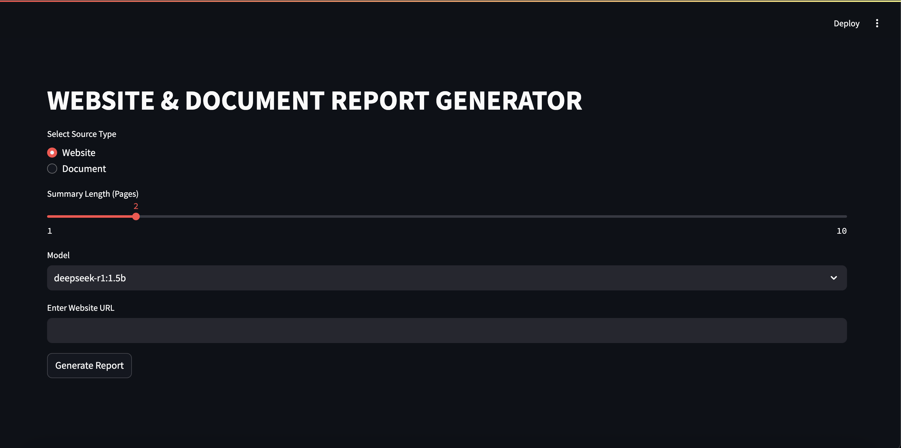

# WebSite_Summarizer
Summarize any website using LLMs

Offline Website Summarization Tool powered by Ollama + DeepSeek.

## Features
- Website scraping
- Page-length controlled summary
- CLI & Streamlit UI
- Multi-model support
- Markdown export
- Document summarizer

## Run

streamlit run app.py

## WebInterface for the Website summarizer

## WebInterface for Website summarizer and Document summarizer

